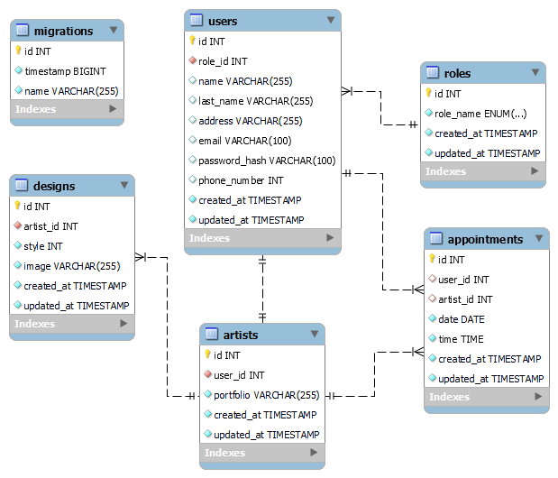

###### 

<h1 align="center"> Tattoink </h1>
 

## Contenido del proyecto 

<details>
  <summary>Contentido 📝</summary>
<ol>
  <a href="#"></a></li>
  <li><a href="#objetivos">Objectivos</a></li>
  <li><a href="#descripción">Descripción</a></li> 
  <li><a href="#tecnologíasutilizadas">Tecnologías utilizadas</a></li>
  <li><a href="#diagrama DB ">Diagrama DB</a></li>
  <li><a href="#endpoints">Endpoints</a></li>
  <li><a href="#futuras funcionalidades">Futuras funcionalidades</a></li>
  <li><a href="#acknowledgments">Acknowledgments</a></li>
  <li><a href="#contacto">Contacto</a></li>
</ol>
</details>

## Objetivo

Este proyecto requería una API funcional con una base de datos que contara con algunos de los tipos de relaciones que existen.

## Descripción

Se ha desarrollado un sistema backend para respaldar las operaciones de un estudio de tatuajes, el cual permitirá al estudio registrar y gestionar usuarios, simplificando el proceso de inicio de sesión tanto para clientes como para artistas. Además, posibilitará la creación y seguimiento de nuevas citas para clientes y artistas, mejorando así la eficiencia en la programación de tatuajes.

El sistema también contará con funciones avanzadas para el superadministrador, quien tendrá la capacidad de gestionar roles, eliminar usuarios y hacer un seguimiento de todas las citas. 

Con esta aplicación, el estudio tendrá un flujo de trabajo más organizado y efectivo para la gestión de citas y usuarios, mejorando la experiencia tanto para el personal del estudio como para los clientes.

## Tecnologias utilizadas
<div align="center">


 </div>

## Diagrama DB 

En el diagrama se puede observar que cada usuario tendrá un role asignado, este podrá ser customer para cliente, artist para tatuadores o superadmin que serán los encargados de gestionar la aplicación. 

Por otro lado, cada cliente puede reservar una cita con el tatuador de su preferencia, los tatuadores podrán ver todas las citas que han sido reservadas con ellos. 

<div style="text-align: center;">
 
</div>

## Endpoints 
<details>
<summary>USERS ENDPOINTS</summary>

- USERS
    - REGISTER

            POST http://localhost:3000/api/register
        body:
        ``` js
            {
                "name":"Waiter",
                "last_name":"Newis",
                "address":"461 Kim Circle",
                "email":"wnewis2@diigo.com",
                "password_hash":"123456",
                "phone_number":"123456789"
            }
        ```
    - LOGIN

            POST http://localhost:3000/api/login
        body:
        ``` js
            {
                "email": "wnewis2@diigo.com",
                "password": "123456" 
            }
        ```
    - PROFILE

            GET http://localhost:4000/user/:id

        -   Insertamos el ID del user para que nos muestre todos los datos

    - UPDATE

            PATCH http://localhost:3000/api/:id
        body:
        ``` js
            {
                "name": "NewUserNew  ", 
                "password": "NewPrinces1234@",
                "phone_number": "55555559"
            }
        ```
    - GET ALL ARTISTS

            GET http://localhost:3000/api/artists/list
        


</details>
<details>
<summary>APPOINTMENTS ENDPOINTS</summary>

- APPOINTMENTS
    - CREATE

            POST http://localhost:3000/api/appointments/newAppointment
        body:
        ``` js
            {
                "user_id": "1",
                "date": "2024/03/28",
                "time": "14:00"
            }

        ```
    - UPDATE

            PATCH http://localhost:3000/api/appointments/:id
        body:
        ``` js
            {
                "user_id": "1",
                "date": "2024-03-29",
                "time": "14:00"
            }
        ```
    - DELETE

            DELETE http://localhost:3000/api/appointments/:id
        body:
        ``` js
            {
               "id": "6"
            }
        ```
    - GET ALL APPOINTMENTS BY USER

            GET http://localhost:4000/appointment/getAllAppointment?skip=10&page=1
        

    - GET ALL APPOINTMENTS BY WORKER

            GET http://localhost:4000/appointment/getAllArtist?skip=5&page=1
        
    

</details>


## Futuras funcionalidades

<input type="checkbox"> Añadir la funcionalidad para que no se solapen las citas.
<br>
<input type="checkbox"> Limitar los accesos al customer.
<br>
<input type="checkbox"> Cambiar el formato de la fecha.
<br>
<input type="checkbox"> Permitir que puedan añadir más productos en una misma cita. 

  
## Agradecimientos

"Quiero expresar mi más sincero agradecimiento a mis compañeros. Aunque trabajamos en proyectos individuales, su apoyo constante y disposición para compartir ideas fueron fundamentales para superar los desafíos que surgieron durante el desarrollo. Juntos, demostramos un compromiso excepcional, creatividad inigualable y una colaboración sin igual.
 
<strong>Erika Orlando</strong><br>
<a href="https://github.com/AkireOrl">

</a>
  
<strong>Reynaldo Muñoz</strong><br>
<a href="https://github.com/ReynaldoMunozF">

</a> 

<strong>Antonio Yepez</strong><br>
<a href="https://github.com/kxlde">

</a> 

<strong>Hector Soriano</strong><br>
<a href="https://github.com/HSoriano99">

</a> 
  
## Author

- **Gabriel Escudillo**

## Contacto   
<a href = "gabrielescudillo@gmail.com"  target="_blank">

</a>
<a href="https://github.com/GabrielEscudillo"  target="_blank">
    
</a>  
<a href="https://www.linkedin.com/in/gabriel-escudillo-b8b436134/" target="_blank">

</a> 

 