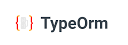

###### 

<h1 align="center"> Tattoink </h1>
 
<div style="text-align: center;"> #Backend app </div>

## Contenido del proyecto 

<details>
  <summary>Contentido 📝</summary>
<ol>
  <a href="#"></a></li>
  <li><a href="#objetive">Objectivos</a></li>
  <li><a href="#about-the-project">About the Project</a></li> 
  <li><a href="#stack">Stack</a></li>
  <li><a href="#diagrama-db">Diagram Database</a></li>
  <li><a href="#local-installation">Local Installation</a></li>
  <li><a href="#endpoints">Endpoints</a></li>
  <li><a href="#validations">Validations</a></li>
  <li><a href="#future-functionalities">Future Functionalities</a></li>
  <li><a href="#contributions">Contributions</a></li>
  <li><a href="#acknowledgments">Acknowledgments</a></li>
  <li><a href="#contact">Contact</a></li>
  <li><a href="#images">Imagenes</a></li>
</ol>
</details>

## Objetivos


<!-- This project required a functional API connected to a database with at least a one-to-many relationship and a many-to-many relationship. -->

<div style="text-align: center;">
    
</div>

## Descripción
<!-- I have decided to develop a backend system to support a tattoo shop. This system will allow the shop to register and manage users, making the login process easier for both customers and employees. Additionally, the system will enable the creation and tracking of new appointments for customers and artists, thus improving efficiency in tattoo scheduling.

The system will also include advanced features for the superadministrator, who will have the ability to manage roles, delete users, and track all active appointments in the shop. This solution will provide a more organized and effective workflow for the management of appointments and users, enhancing the experience for both shop staff and customers.   -->

<div style="text-align: center;"></div>

## Stack
<div align="center">





 </div>

## Diagrama DB 
<!-- In the diagram, we can observe that each user can only have one role, including 'user' for store customers, 'admin' for employees, and 'superadmin' for those who acquire the role of managing the application, possibly the store manager.

On the other hand, each customer can make a reservation, and thanks to the validations, it has been ensured that they do not overlap with any other customer if the tattoo artist already has a reservation for that date or time, preventing the reservation system from becoming overloaded.

The tattoo artist can track the appointments assigned to them, with the ability to paginate them and view detailed information for each appointment. -->

<div style="text-align: center;">
 
</div>

## Local Installation

<details>
<summary>Installation</summary>

1. Clone the repository.

2. Install the dependencies required for the project. 

    - ` $ npm install ` 
    
    Alternatively, you can install all the dependencies with the following command:

    - ` $ npm i express typescript nodemon ts-node @types/express @types/node mysql2 reflect-metadata typeorm bcrypt @types/bcrypt jsonwebtoken @types/jsonwebtoken dotenv` 


3. Connect your repository to the database by creating the .env file and adding the appropriate database credentials:

``` js
        // DB Credentials
        PORT =   
        DB_HOST= 
        DB_USERNAME= ""
        DB_PASSWORD= ""
        DB_NAME=""
        DB_PORT=   
        //  JWT Secret  
        JWT_SECRET= ""

```  
4.  Run the migrations:
    - `$ npx typeorm-ts-node-commonjs migration:run -d ./src/db.ts`
5. $ Run the seeders 
6. Execute the application with the following command: 
    - ` $ npm run dev ` 
</details>

## Endpoints 
<details>
<summary>USERS ENDPOINTS</summary>

- USERS
    - REGISTER

            POST http://localhost:4000/user/register
        body:
        ``` js
            {
                "user": "NewUser",
                "email": "NewUser@NewUser.com",
                "password": "princes1234@"
            }
        ```

    - LOGIN

            POST http://localhost:4000/user/login
        body:
        ``` js
            {
                "email": "NewUser@NewUser.com",
                "password": "princes1234@" 
            }
        ```
    - PROFILE

            GET http://localhost:4000/user/profile

        - Auth: ` Enter the token to access the profile.`

    - UPDATE

            PUT http://localhost:4000/user/update
        body:
        ``` js
            {
                "full_name": "NewUserNew  ", 
                "password": "NewPrinces1234@",
                "phone_number": 55555559
            }
        ```
        - Auth: `Enter the token to update.`

    - GET ALL WORKER

            GET http://localhost:4000/user/AllWorkers?skip=5&page=1
        
        - Auth: ` Enter the token to get the list of workers.`

</details>
<details>
<summary>APPOINTMENTS ENDPOINTS</summary>

- APPOINTMENTS
    - CREATE

            POST http://localhost:4000/appointment/createAppointment
        body:
        ``` js
            {
                "date": "2023-12-10",
                "shift": "afternoon",
                "email": "worker3@mail.com", 
                "name": "dragon"
            }
        ```
        - Auth: `Enter the token to create the appointment.`

    - UPDATE

            PUT http://localhost:4000/appointment/updateAppointment
        body:
        ``` js
            {
               "id": 60,
                "date": "2024-11-05",
                "shift": "morning",
                "email":"worker1@mail.com",
                "name":"tattoo2"
            }
        ```
         - Auth: `Enter the token to update the appointment.`

    - DELETE

            DELETE http://localhost:4000/appointment/deleteAppointment
        body:
        ``` js
            {
               "id": 60 
            }
        ```
         - Auth: `Enter the token to delete the appointment.`

    - GET ALL APPOINTMENTS BY USER

            GET http://localhost:4000/appointment/getAllAppointment?skip=10&page=1
        
         - Auth: `Enter the token to retrieve the appointments.`

    - GET ALL APPOINTMENTS BY WORKER

            GET http://localhost:4000/appointment/getAllArtist?skip=5&page=1
        
         - Auth: `Enter the token to get the appointments.`
    
    - APPOINTMENT DETAIL

            GET http://localhost:4000/appointment/appointmentDetail
        body:
        ``` js
            {
               "id": 60 
            }
        ```
         - Auth: `Enter the token to get the detailed appointment`

    - APPOINTMENT VALIDATION

            GET http://localhost:4000/appointment/validation
        body:
        ``` js
            {  
                "email":"worker1@mail.com",
                "shift":"morning",
                "date":"2023-12-05"
            }
        ```
         - Auth: `Enter the token to validate the appointment.`

</details>


## Future functionalities
<!-- 
<input type="checkbox">  Allow the tattoo artist to update appointments.
<br>
<input type="checkbox"> Allow the tattoo artist to update appointments.
<br>
<input type="checkbox"> Allow the tattoo artist to create appointments for clients.
<br>
<input type="checkbox"> Customized portfolio. 
<br>
<input type="checkbox">  Allow multiple products in one appointment. -->


<!-- ## Contributions
Suggestions and contributions are always welcome. 

You can do this in two ways:

1. Opening an issue.
2. Fork the repository
    - Create a new branch.  
        ```
        $ git checkout -b feature/username-improvement
        ```
    - Commit your changes.
        ```
        $ git commit -m 'feat: improve X thing'
        ```
    - Push the branch.
        ```
        $ git push origin feature/username-improvement
        ```
    - Open a Pull Request. -->

<!-- ## License

This project is under the MIT License. Please refer to the LICENSE file for more information. -->

  
## Acknowledgments

<!-- This project has been made possible thanks to the hard work of my teachers Daniel Tarazona and David Ochando, who not only share their knowledge but also instill enthusiasm in us for what we are developing. -->

  
<!-- <strong>Daniel Tarazona</strong><br>
<a href="https://github.com/datata">

</a>
  
<strong>David Ochando</strong><br>
<a href="https://github.com/Dave86dev">

</a>  -->
  
## Author

- **Gabriel Escudillo**

## Contact   
<a href = "gabrielescudillo@gmail.com"  target="_blank">

</a>
<a href="https://github.com/GabrielEscudillo"  target="_blank">
    
</a>  
<a href="https://www.linkedin.com/in/gabriel-escudillo-b8b436134/" target="_blank">

</a> 

[](#) 
 

## Images

<br>
<div style="text-align: center;">
    
</div>
<br>
<div style="text-align: center;">
    
</div>
<br>
<div style="text-align: center;">
    
</div>

 [](#)